# HW3

## [Регистрация](https://ads.vk.com/hq/registration)

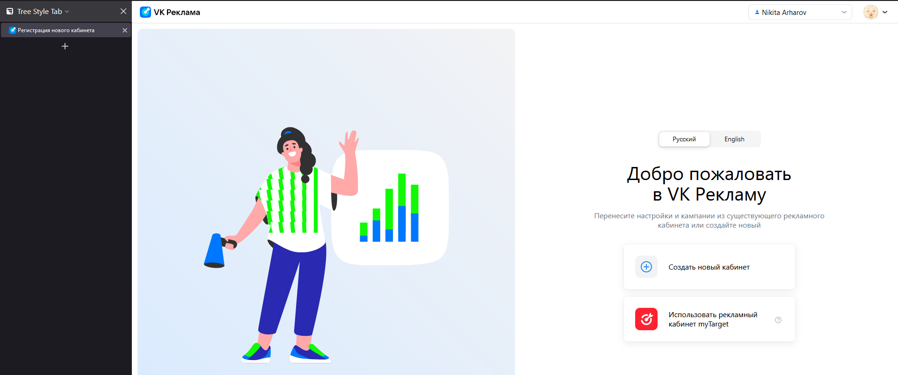

* При нажатии на переключатель языка English с выбранным языком Русский язык текста на странице меняется на английский
* При нажатии на переключатель языка English с выбранным языком Русский название вкладки меняется с русского "Регистрация нового кабинета" на английское "Registration of a new account"
* При нажатии на переключатель языка English с выбранным языком Русский текст в логотипе меняется с "VK Реклама" на "VK Ads"

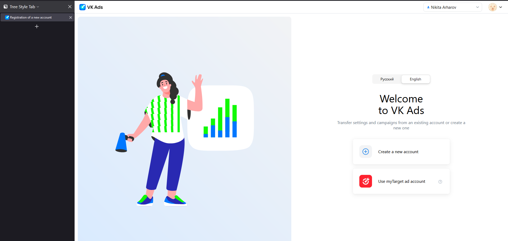

* При нажатии на переключатель языка Русский с выбранным языком English язык текста на странице меняется на русский
* При нажатии на переключатель языка Русский с выбранным языком English название вкладки меняется с английского "Registration of a new account" на русское "Регистрация нового кабинета"
* При нажатии на переключатель языка Русский с выбранным языком English текст в логотипе меняется с "VK Ads" на "VK Реклама"
* При нажатии на переключатель языка English с выбранным языком English ничего не происходит
* При нажатии на переключатель языка Русский с выбранным языком Русский ничего не происходит
* При нажатии кнопки "Создать новый кабинет" в русскоязычной версии открывается форма регистрации нового кабинета на русском
* ***Баг*** При нажатии кнопки "Создать новый кабинет" в русскоязычной версии название вкладки меняется на английское "Creating a new account"
* При нажатии кнопки "Create a new account" в англоязычной версии открывается форма регистрации нового кабинета на английском
* ***Баг*** При нажатии кнопки "Create a new account" в англоязычной версии название вкладки меняется на английское "Создание нового кабинета"
* При нажатии кнопки "Использовать рекламный кабинет myTarget" в русскоязычной версии открывается фрейм с описанием последствий импорта рекламного кабинета myTarget на русском
* ***Баг*** При нажатии кнопки "Использовать рекламный кабинет myTarget" в русскоязычной версии название вкладки меняется на английское "Import account from myTarget"
* При нажатии кнопки "Use myTarget ad account" в англоязычной версии открывается фрейм с описанием последствий импорта рекламного кабинета myTarget на английском
* ***Баг*** При нажатии кнопки "Use myTarget ad account" в англоязычной версии название вкладки меняется на английское "Импорт кабинета из myTarget"
* При наведении курсора на знак вопроса на кнопке "Использовать рекламный кабинет myTarget" в русскоязычной версии всплывает pop-up окно с кратким описанием последствий импорта на русском
* При наведении курсора на знак вопроса на кнопке "Use myTarget ad account" в англоязычной версии всплывает pop-up окно с кратким описанием последствий импорта на английском

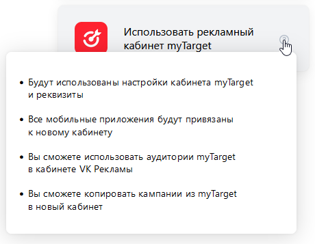 
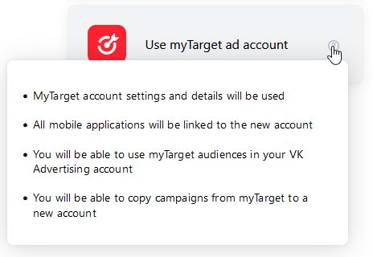

### [Регистрация нового кабинета](https://ads.vk.com/hq/registration/new)

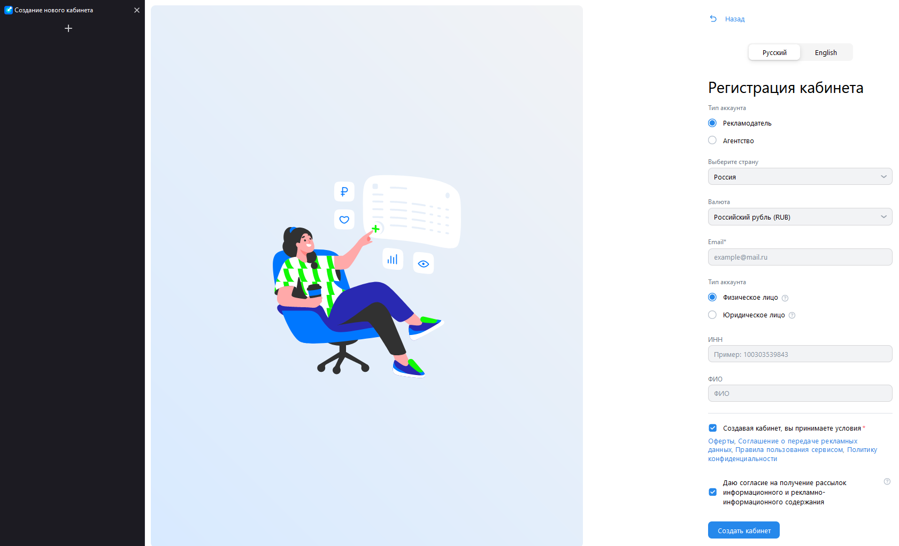

* При нажатии кнопки "Назад" в русскоязычной версии происходит возвращение на русскоязычную версию [страницы регистрации](#регистрация)
* При нажатии кнопки "Back" в англоязычной версии происходит возвращение на англоязычную версию [страницы регистрации](#регистрация)
* При нажатии на переключатель языка English с выбранным языком Русский язык текста на странице меняется на английский 
* ***Баг*** При нажатии на переключатель языка English с выбранным языком Русский название вкладки меняется на "Registration of a new account"

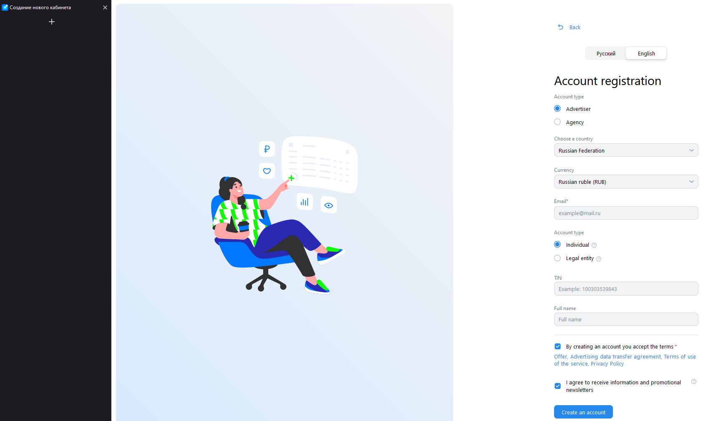

* При нажатии на переключатель языка Русский с выбранным языком English язык текста на странице меняется на русский 
* ***Баг*** При нажатии на переключатель языка Русский с выбранным языком English название вкладки меняется на "Регистрация нового кабинета"
* При нажатии на выпадающее меню выбора страны открывается список стран
* При нажатии на выпадающее меню выбора валюты при выбранной стране Россия меню содержит только рубль

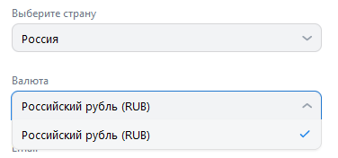

* При выборе страны, отличной от России, и нажатии на выпадающее меню выбора валюты меню содержит доллар США и евро

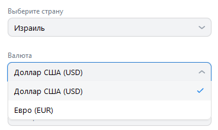

* При вводе корректного адреса ничего не происходит
* При вводе некорректного адреса инпут подсвечивается красным и появляется надпись "Некорректный email адрес"
* При повторном вводе корректного адреса в инпут Email подсвечивание и надпись пропадают
* При очищении заполненного инпута Email инпут сразу же подсвечивается красным и появляется надпись "Обязательное поле"

* При нажатии радиобаттона Рекламодатель появляются два радиобаттона Физическое лицо и Юридическое лицо
* При нажатии радиобаттона Агентство появляется единственный радиобаттон Юридическое лицо

* При нажатии радиобаттона Физическое лицо при выбранной стране Россия появляются инпуты ИНН и ФИО
* При выборе страны, отличной от России, и нажатии радиобаттона Физическое лицо, появляются инпут ИНН и предупреждение "Создание рекламного кабинета для физических лиц доступно только при выборе России.", кнопка "Создать кабинет" становится неактивной

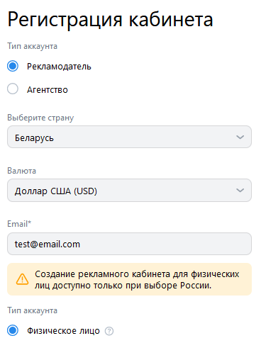

* При наведении курсора на знак вопроса рядом с радиобаттоном Физическое лицо всплывает pop-up окно с кратким описанием требований к физическим лицам и доступных способов оплаты

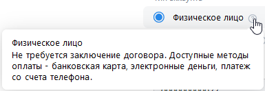

* При вводе цифр в инпут ИНН цифры появляются в инпуте
* При вводе текста (латиница) в инпут ИНН текст не появляется в инпуте
* При вводе текста (кириллица) в инпут ИНН текст не появляется в инпуте
* При вводе 12 цифр в инпут ИНН ничего не происходит
* При вводе менее 12 цифр в инпут ИНН инпут подсвечивается красным и появляется надпись "Минимальная длина 12"
* При повторном вводе 12 цифр после ввода менее 12 цифр в инпут ИНН подсвечивание и надпись пропадают
* При вводе больше 12 цифр в инпут ИНН инпут подсвеичвается красным и появляется надпись "Максимальная длина 12 символов"
* При повторном вводе 12 цифр после ввода более 12 цифр в инпут ИНН подсвечивание и надпись пропадают
* ***Баг*** Если ввести текст в инпут ФИО, нажать на любое выпадающее меню, затем на кнопку назад и снова зайти в регистрацию нового кабинета, введённый текст окажется в поле ИНН

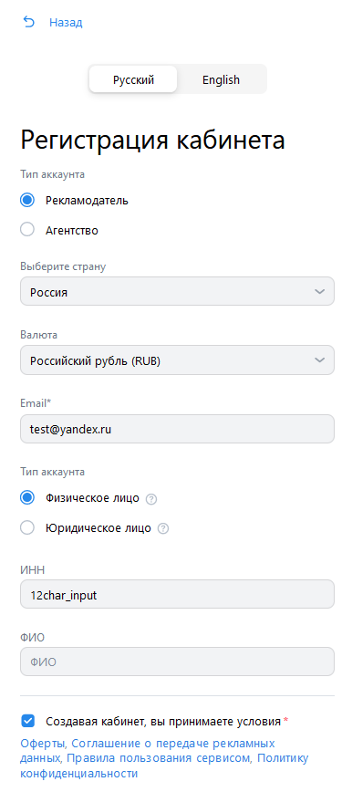

* При нажатии радиобаттона Юридическое лицо дополнительные инпуты не появляются

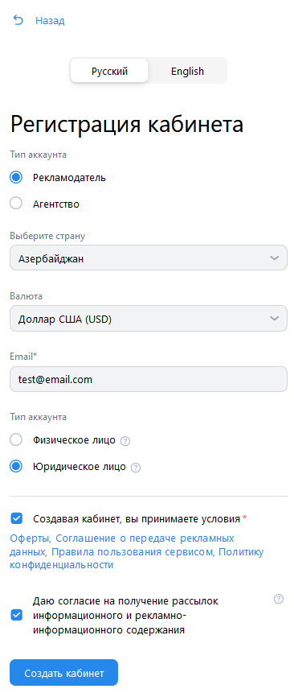

* При наведении курсора на знак вопроса рядом с радиобаттоном Юридическое лицо высплывает pop-up окно с кратким описанием особенностей работы с юридическими лицами

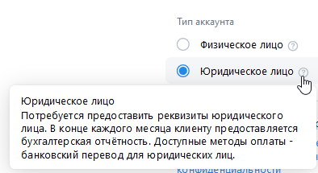

* При нажатии на отмеченный чекбокс о принятии условий отметка убирается
* При нажатии на неотмеченный чекбокс о принятии условий отметка появляется
* При нажатии на ссылку Оферты при нажатом радиобаттоне Физическое лицо и выбранной стране Россия открывается [русскоязычная страница оферты для физических лиц резидентов РФ](https://ads.vk.com/documents/offer_fl_vk)
* ***Баг*** При нажатии на ссылку Оферты при нажатом радиобаттоне Физическое лицо и выбранной стране, отличной от России, открывается [русскоязычная страница оферты для физических лиц резидентов РФ](https://ads.vk.com/documents/offer_fl_vk)
* ***Баг*** При нажатии на ссылку Offer в англоязычной версии сайта при нажатом радиобаттоне Individual и выбранной стране Russian Federation открывается [русскоязычная страница 404](https://ads.vk.com/documents/offer_fl_vk_en)
* ***Баг*** При нажатии на ссылку Offer в англоязычной версии сайта при нажатом радиобаттоне Individual и выбранной стране, отличной от Russian Federation, открывается [русскоязычная страница 404](https://ads.vk.com/documents/offer_fl_vk_en)

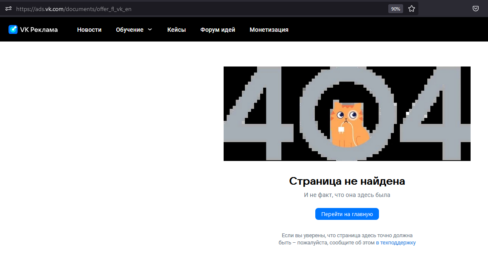

* ***Баг*** При нажатии на ссылку Оферты при нажатом радиобаттоне Физическое лицо и выбранной стране, отличной от России, открывается [русскоязычная страница оферты для физических лиц резидентов РФ](https://ads.vk.com/documents/offer_fl_vk)
* При нажатии на ссылку Оферты при нажатом радиобаттоне Юридическое лицо и выбранной стране Россия открывается [русскоязычная страница оферты для юридических лиц резидентов РФ](https://ads.vk.com/documents/offer_adv_vk)
* ***Баг*** При нажатии на ссылку Offer в англоязычной версии сайта при нажатом радиобаттоне Legal entity и выбранной стране Russian Federation открывается [англоязычная страница оферты для юридических лиц нерезидентов РФ](https://ads.vk.com/documents/offer_adv_vk_en)
* ***Баг*** При нажатии на ссылку Оферты в русскоязычной версии сайта при нажатом радиобаттоне Юридическое лицо и выбранной стране, отличной от России, открывается [русскоязычная страница оферты для юридических лиц резидентов РФ](https://ads.vk.com/documents/offer_adv_vk)
* При нажатии на ссылку Offer в англоязычной версии сайта при нажатом радиобаттоне Legal entity и выбранной стране, отличной от Russian Federation, открывается [англоязычная страница оферты для юридических лиц нерезидентов РФ](https://ads.vk.com/documents/offer_adv_vk_en)
* При нажатии на ссылку Оферты в русскоязычной версии сайта при нажатом радиобаттоне Агентство открывается [русскоязычная страница оферты для рекламных агенств](https://ads.vk.com/documents/offer_agency_vk)
* При нажатии на ссылку Offer в англоязычной версии сайта при нажатом радиобаттоне Agency открыватся [англоязычная страница оферты для рекламных агенств](https://ads.vk.com/documents/offer_agency_vk_en)
* При нажатии на ссылку Соглашение о передаче рекламных данных в русскоязычной версии сайта открывается [русскоязычная страница условий оказания услуг информационного взаимодействия с ОРД](https://ads.vk.com/documents/ord_clients)
* ***Баг*** При нажатии на ссылку Advertising data transfer agreement в англоязычной версии сайта открывается [русскоязычная страница условий оказания услуг информационного взаимодействия с ОРД](https://ads.vk.com/documents/ord_clients)
* При нажатии на ссылку Правила пользования сервисом в русскоязычной версии сайта открывается [русскоязычная страница пользовательского соглашения VK Рекламы](https://help.mail.ru/legal/terms/adsvk/terms)
* При нажатии на ссылку Terms of use of the service в англоязычной версии сайта открывается [англоязычная страница пользовательского соглашения VK Рекламы](https://help.mail.ru/legal/terms/adsvk/termsofservice)
* При нажатии на ссылку Политику конфиденциальности в русскоязычной версии сайта открывается [русскоязычная страница политики конфиденциальности VK Рекламы](https://help.mail.ru/legal/terms/adsvk/termsofservice)
* При нажатии на ссылку Privacy Policy в русскоязычной версии сайта открывается [англоязычная страница политики конфиденциальности VK Рекламы](https://help.mail.ru/legal/terms/adsvk/euprivacy)
* При нажатии на отмеченный чекбокс согласия на получение рассылок отметка убирается
* При нажатии на неотмеченный чекбокс согласия на получение рассылок отметка появляется
* При наведении на знак вопроса рядом с чекбоксом согласия на получение рассылок информационного и рекламно-информационного содержания всплывает pop-up окно с описанием содержания рассылок

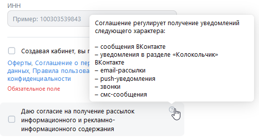

* При попытке создать кабинет в качестве Рекламодателя-физического лица с незаполненным инпутом Email и отмеченным чекбоксом о принятии условий инпут Email подсвечивается красным и появляется надпись "Обязательное поле"
* При попытке создать кабинет в качестве Рекламодателя-физического лица с некорректно заполненным инпутом Email и отмеченным чекбоксом о принятии условий инпут Email подсвечивается красным и появляется надпись "Некорректный email адрес"
* При попытке создать кабинет в качестве Рекламодателя-физического лица с незаполненным инпутом Email и неотмеченным чекбоксом о принятии условий инпут Email подсвечивается красным, под инпутом и чекбоксом появляется надпись "Обязательное поле"
* При попытке создать кабинет в качестве Рекламодателя-физического лица с некорректно заполненным инпутом Email и неотмеченным чекбоксом о принятии условий инпут Email подсвечивается красным, под инпутом появляется надпись "Некорректный email адрес", под чекбоксом появляется надпись "Обязательное поле"
* При попытке создать кабинет в качестве Рекламодателя-физического лица с некорректно заполненным инпутом Email и отмеченным чекбоксом о принятии условий инпут Email подсвечивается красным и появляется надпись "Некорректный email адрес"
* При нажатии на кнопку "Создать кабинет" в качестве Рекламодателя с корректно заполненным инпутом Email и отмеченным чекбоксом о принятии условий происходит перенаправление на [главную страницу рекламного кабинета рекламодателя](https://ads.vk.com/hq/overview)
* При нажатии на кнопку "Создать кабинет" в качестве Агентства с отмеченным чекбоксом о принятии условий происходит перенаправление на [главную страницу рекламного кабинета агентства](https://ads.vk.com/hq/dashboard)

### [Импорт рекламного кабинета myTarget](https://ads.vk.com/hq/registration/import/target)

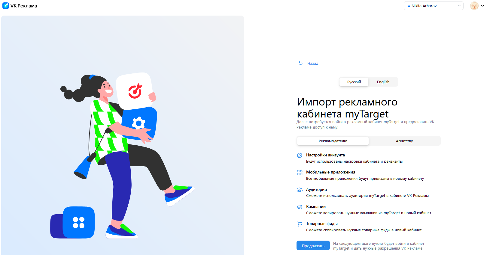

* При нажатии кнопки Назад происходит вовзращение на русскоязычную версию [страницы регистрации](#регистрация)
* При нажатии на переключатель языка English с выбранным языком Русский язык текста на странице с описанием последствий импорта для рекламодателя меняется на английский
* При нажатии кнопки Back происходит вовзращение на англоязычную версию [страницы регистрации](#регистрация)
* При нажатии на переключатель языка Русский с выбранным языком English язык текста на странице с описанием последствий импорта для рекламодателя меняется на русский
* При нажатии на переключатель языка English с выбранным языком English ничего не происходит
* При нажатии на переключатель языка Русский с выбранным языком Русский ничего не происходит

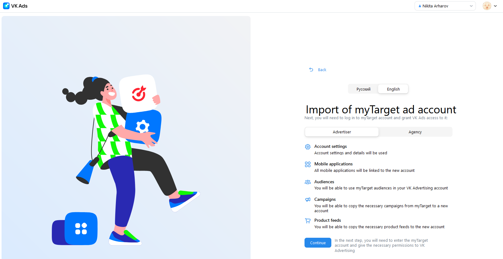

* При нажатии на переключатель Рекламодателю с выбранным положением Рекламодателю ничего не происходит
* При нажатии на переключатель Агентству с выбранным положением Рекламодателю текст на странице меняяется на описание последствий импорта кабинета рекламного агентства

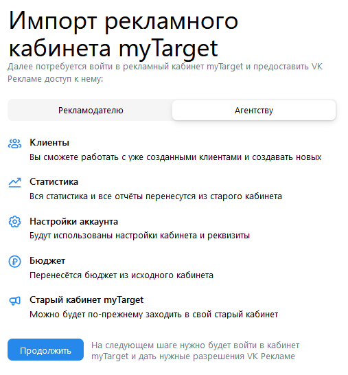

* При нажатии на переключатель Агентству с выбранным положением Агенству ничего не происходит
* При нажатии на переключатель Рекламодателю с выбранным положением Агентству текст на странице меняяется на описание последствий импорта кабинета рекламодателя
* При нажатии на переключатель языка English с выбранным языком Русский язык текста на странице с описанием последствий импорта для рекламного агентства меняется на английский
* При нажатии на переключатель языка Русский с выбранным языком English язык текста на странице с описанием последствий импорта для рекламного агентства меняется на русский
* При нажатии кнопки "Продолжить" происходит переадресация на сайт [myTarget](https://target.my.com/)

## Хедер

* При нажатии на логотип до завершения регистрации открывается [страница регистрации](#регистрация)
* При нажатии на выпадающее меню с именем текущего VK ID появляется [меню выбора рекламного кабинета](#меню-выбора-рекламного-кабинета)
* При нажатии на аватарку появляется меню VK ID

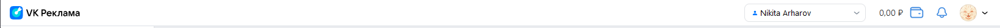

* При нажатии на логотип после завершения регистрации при выбранном рекламном кабинете Рекламодателя происходит перенаправление на [главную страницу рекламного кабинета рекламодателя](https://ads.vk.com/hq/overview)
* При нажатии на логотип после завершения регистрации при выбранном рекламном кабинете Рекламодателя происходит перенаправление на [главную страницу рекламного кабинета агентства](https://ads.vk.com/hq/dashboard)
* При нажатии на иконку кошелька с балансом открывается всплывающее окно пополнения баланса

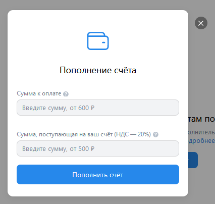

* При нажатии за пределами окна окно закрывается
* При нажатии на крестик рядом с окном окно закрывается

* При нажатии на иконку колокольчика появляется pop-up окно с уведомлениями

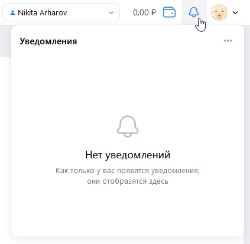

* При нажатии за пределами окна окно закрывается
* При нажатие на троеточие в верхнем правом углу окна всплывает кнопка Отметить всё как прочитанные

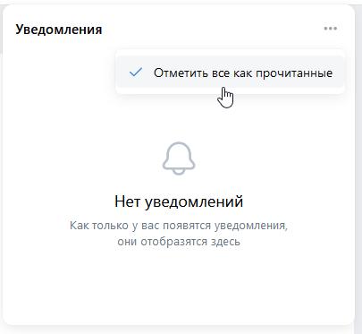

### Меню выбора рекламного кабинета

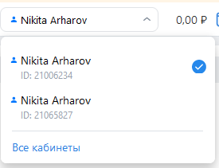

* При нажатии на кнопку "Все кабинеты" до завершения регистрации происходит перенаправление на [страницу регистрации](#регистрация)
* При нажатии за пределами меню меню пропадает
* Если язык английский, текст на кнопке меняется на "All accounts"
* При наличии нескольких аккаунтов текущий аккаунт отмечен галочкой
* При наличии нескольких аккаунтов, если текущий аккаунт является аккаунтом Рекламодателя, и был нажат аккаунт Агентства, происходит перенаправление на [главную страницу рекламного кабинета агентства](https://ads.vk.com/hq/dashboard)
* При наличии нескольких аккаунтов, если текущий аккаунт является аккаунтом Агентства, и был нажат аккаунт Рекламодателя, происходит перенаправление на [главную страницу рекламного кабинета рекламодателя](https://ads.vk.com/hq/overview)
* При нажатии на кнопку "Все кабинеты" после завершения регистрации при выбранном кабинете Агенства происходит перенаправление на [главную страницу рекламного кабинета агентства](https://ads.vk.com/hq/dashboard)
* При нажатии на кнопку "Все кабинеты" после заверешения регистрации при выбранном кабинете Рекламодателя происходит перенаправление на [страницу управления правами доступа](https://ads.vk.com/hq/settings/access)