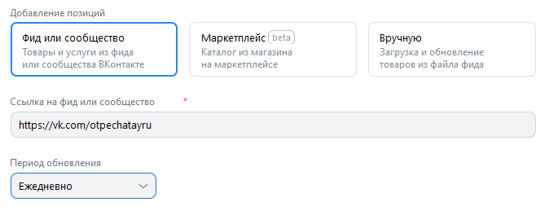
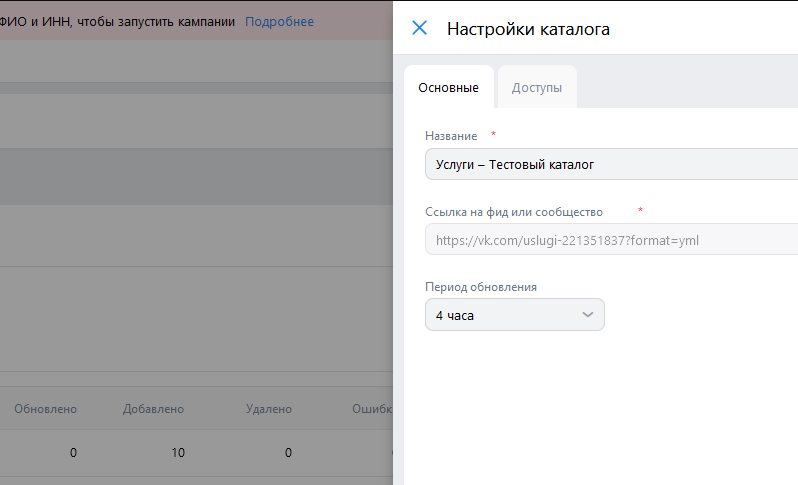

# HW3

## [Регистрация](https://ads.vk.com/hq/registration)

* При переходе на страницу рисуются хедер, изображение в левой половине страницы, [переключатель между языками](#регистрация-1), заголовок "Добро пожаловать
в VK Рекламу", подзаголовок "Перенесите настройки и кампании из существующего рекламного кабинета или создайте новый", кнопка "Создать новый кабинет" с иконкой, кнопка "Использовать рекламный кабинет myTarget" с иконкой

* При нажатии кнопки "Создать новый кабинет" открывается [форма регистрации нового кабинета](#регистрация-нового-кабинета)
* При нажатии кнопки "Использовать рекламный кабинет myTarget" открывается страница [импорта рекламного кабинета myTarget](#импорт-рекламного-кабинета-mytarget)
* При наведении курсора на знак вопроса на кнопке "Использовать рекламный кабинет myTarget" всплывает pop-up окно с кратким описанием последствий импорта

 

### [Регистрация нового кабинета](https://ads.vk.com/hq/registration/new)

* При переходе на страницу рисуются хедер, изображение в левой половине страницы, [переключатель между языками](#регистрация-нового-кабинета-1), кнопка "Назад", заголовок "Регистрация кабинета", радиобаттоны для выбора типа аккаунта (Рекламодатель, Агентство) с подписью "Тип аккаунта" над радиобаттонами, выпадающее меню для выбора страны с подписью "Выберите страну" над меню, выпадающее меню для выбора валюты с подписью "Валюта" над меню, инпут для ввода email с подписью "Email*" над инпутом, радиобаттоны для выбора типа аккаунта (Физическое лицо, Юридическое лицо), знаки вопроса рядом справа от радиобаттонов и подпись "Тип аккаунта", инпут для ввода ИНН с подписью "ИНН", инпут для ввода ФИО с подписью "ФИО", отмеченный чекбокс для принятия условий с подписью "Создавая кабинет, вы принимаете условия *" справа от чекбокса, текст "Оферты" с ссылкой на оферту, "Соглашение о передаче рекламных данных" с ссылкой на соглашение о передаче рекламных данных, "Правила пользования сервисом" с ссылкой на правила пользования сервисом, "Политику конфиденциальности" с ссылкой на политику конфиденциальности, отмеченный чекбокс соглашения на получение рассылки с текстом "Даю согласие на получение рассылок информационного и рекламно-информационного содержания" справа от него и знак вопроса ещё правее, кнопка "Создать кабинет"

* При нажатии кнопки "Назад" с происходит возвращение на [страницу регистрации](#регистрация)
* При нажатии на выпадающее меню выбора страны открывается список стран

* При нажатии на выпадающее меню выбора валюты при выбранной стране Россия меню содержит только рубль

* При выборе страны, отличной от России, и нажатии на выпадающее меню выбора валюты меню содержит доллар США и евро

* При вводе корректного адреса (`test@email.com`) ничего не происходит
* При вводе корректного адреса (`A@b.co`) ничего не происходит
* При вводе некорректного адреса (`test`) инпут подсвечивается красным и появляется надпись "Некорректный email адрес"
* При вводе некорректного адреса (`123`) инпут подсвечивается красным и появляется надпись "Некорректный email адрес"
* При вводе некорректного адреса (`test@.com`) инпут подсвечивается красным и появляется надпись "Некорректный email адрес"
* При повторном вводе корректного адреса в инпут Email подсвечивание и надпись пропадают
* При очищении заполненного инпута Email инпут сразу же подсвечивается красным и появляется надпись "Обязательное поле"

* При нажатии радиобаттона Рекламодатель появляются два радиобаттона Физическое лицо и Юридическое лицо
* При нажатии радиобаттона Агентство появляется единственный радиобаттон Юридическое лицо

* При нажатии радиобаттона Физическое лицо при выбранной стране Россия появляются инпуты ИНН и ФИО
* При выборе страны, отличной от России, и нажатии радиобаттона Физическое лицо, появляются инпут ИНН и предупреждение "Создание рекламного кабинета для физических лиц доступно только при выборе России.", кнопка "Создать кабинет" становится неактивной

* При наведении курсора на знак вопроса рядом с радиобаттоном Физическое лицо всплывает pop-up окно с кратким описанием требований к физическим лицам и доступных способов оплаты

* При вводе цифр в инпут ИНН цифры появляются в инпуте
* При вводе текста (латиница) в инпут ИНН текст не появляется в инпуте
* При вводе текста (кириллица) в инпут ИНН текст не появляется в инпуте
* При вводе 12 цифр в инпут ИНН ничего не происходит
* При вводе менее 12 цифр в инпут ИНН инпут подсвечивается красным и появляется надпись "Минимальная длина 12"
* При повторном вводе 12 цифр после ввода менее 12 цифр в инпут ИНН подсвечивание и надпись пропадают
* При вводе больше 12 цифр в инпут ИНН инпут подсвеичвается красным и появляется надпись "Максимальная длина 12 символов"
* При повторном вводе 12 цифр после ввода более 12 цифр в инпут ИНН подсвечивание и надпись пропадают
* ***Баг*** Если ввести текст в инпут ФИО, нажать на любое выпадающее меню, затем на кнопку назад и снова зайти в регистрацию нового кабинета, введённый текст окажется в поле ИНН

* При нажатии радиобаттона Юридическое лицо инпуты ИНН и ФИО пропадают

* При наведении курсора на знак вопроса рядом с радиобаттоном Юридическое лицо высплывает pop-up окно с кратким описанием особенностей работы с юридическими лицами

* При нажатии на отмеченный чекбокс о принятии условий отметка убирается
* При нажатии на неотмеченный чекбокс о принятии условий отметка появляется
* При нажатии на ссылку Оферты при нажатом радиобаттоне Физическое лицо и выбранной стране Россия открывается [русскоязычная страница оферты для физических лиц резидентов РФ](https://ads.vk.com/documents/offer_fl_vk)
* ***Баг*** При нажатии на ссылку Оферты при нажатом радиобаттоне Физическое лицо и выбранной стране, отличной от России, открывается [русскоязычная страница оферты для физических лиц резидентов РФ](https://ads.vk.com/documents/offer_fl_vk)
* ***Баг*** При нажатии на ссылку Offer с выбранным языком English при нажатом радиобаттоне Individual и выбранной стране Russian Federation открывается [русскоязычная страница 404](https://ads.vk.com/documents/offer_fl_vk_en)  
* ***Баг*** При нажатии на ссылку Offer с выбранным языком English при нажатом радиобаттоне Individual и выбранной стране, отличной от Russian Federation, открывается [русскоязычная страница 404](https://ads.vk.com/documents/offer_fl_vk_en)

* При нажатии на ссылку Оферты при нажатом радиобаттоне Юридическое лицо и выбранной стране Россия открывается [русскоязычная страница оферты для юридических лиц резидентов РФ](https://ads.vk.com/documents/offer_adv_vk)
* ***Баг*** При нажатии на ссылку Offer с выбранным языком English сайта при нажатом радиобаттоне Legal entity и выбранной стране Russian Federation открывается [англоязычная страница оферты для юридических лиц нерезидентов РФ](https://ads.vk.com/documents/offer_adv_vk_en)
* ***Баг*** При нажатии на ссылку Оферты с выбранным языком Русский сайта при нажатом радиобаттоне Юридическое лицо и выбранной стране, отличной от России, открывается [русскоязычная страница оферты для юридических лиц резидентов РФ](https://ads.vk.com/documents/offer_adv_vk)
* При нажатии на ссылку Offer с выбранным языком English сайта при нажатом радиобаттоне Legal entity и выбранной стране, отличной от Russian Federation, открывается [англоязычная страница оферты для юридических лиц нерезидентов РФ](https://ads.vk.com/documents/offer_adv_vk_en)
* При нажатии на ссылку Оферты с выбранным языком Русский сайта при нажатом радиобаттоне Агентство открывается [русскоязычная страница оферты для рекламных агенств](https://ads.vk.com/documents/offer_agency_vk)
* При нажатии на ссылку Offer с выбранным языком English сайта при нажатом радиобаттоне Agency открыватся [англоязычная страница оферты для рекламных агенств](https://ads.vk.com/documents/offer_agency_vk_en)
* При нажатии на ссылку Соглашение о передаче рекламных данных с выбранным языком Русский сайта открывается [русскоязычная страница условий оказания услуг информационного взаимодействия с ОРД](https://ads.vk.com/documents/ord_clients)
* ***Баг*** При нажатии на ссылку Advertising data transfer agreement с выбранным языком English сайта открывается [русскоязычная страница условий оказания услуг информационного взаимодействия с ОРД](https://ads.vk.com/documents/ord_clients)
* При нажатии на ссылку Правила пользования сервисом с выбранным языком Русский сайта открывается [русскоязычная страница пользовательского соглашения VK Рекламы](https://help.mail.ru/legal/terms/adsvk/terms)
* При нажатии на ссылку Terms of use of the service с выбранным языком English сайта открывается [англоязычная страница пользовательского соглашения VK Рекламы](https://help.mail.ru/legal/terms/adsvk/termsofservice)
* При нажатии на ссылку Политику конфиденциальности с выбранным языком Русский сайта открывается [русскоязычная страница политики конфиденциальности VK Рекламы](https://help.mail.ru/legal/terms/adsvk/privacy)
* При нажатии на ссылку Privacy Policy с выбранным языком Русский сайта открывается [англоязычная страница политики конфиденциальности VK Рекламы](https://help.mail.ru/legal/terms/adsvk/euprivacy)
* При нажатии на отмеченный чекбокс согласия на получение рассылок отметка убирается
* При нажатии на неотмеченный чекбокс согласия на получение рассылок отметка появляется
* При наведении курсора на знак вопроса рядом с чекбоксом согласия на получение рассылок информационного и рекламно-информационного содержания всплывает pop-up окно с описанием содержания рассылок

* При попытке создать кабинет в качестве Рекламодателя-физического лица с незаполненным инпутом Email и отмеченным чекбоксом о принятии условий инпут Email подсвечивается красным и появляется надпись "Обязательное поле"
* При попытке создать кабинет в качестве Рекламодателя-физического лица с некорректно заполненным инпутом Email (`test`) и отмеченным чекбоксом о принятии условий инпут Email подсвечивается красным и появляется надпись "Некорректный email адрес"
* При попытке создать кабинет в качестве Рекламодателя-физического лица с некорректно заполненным инпутом Email (`123`) и отмеченным чекбоксом о принятии условий инпут Email подсвечивается красным и появляется надпись "Некорректный email адрес"
* При попытке создать кабинет в качестве Рекламодателя-физического лица с некорректно заполненным инпутом Email (`test@.com`) и отмеченным чекбоксом о принятии условий инпут Email подсвечивается красным и появляется надпись "Некорректный email адрес"
* При попытке создать кабинет в качестве Рекламодателя-физического лица с незаполненным инпутом Email и неотмеченным чекбоксом о принятии условий инпут Email подсвечивается красным, под инпутом и чекбоксом появляется надпись "Обязательное поле"
* При попытке создать кабинет в качестве Рекламодателя-физического лица с некорректно заполненным инпутом Email (`test`) и неотмеченным чекбоксом о принятии условий инпут Email подсвечивается красным, под инпутом появляется надпись "Некорректный email адрес", под чекбоксом появляется надпись "Обязательное поле"
* При попытке создать кабинет в качестве Рекламодателя-физического лица с некорректно заполненным инпутом Email (`123`) и неотмеченным чекбоксом о принятии условий инпут Email подсвечивается красным, под инпутом появляется надпись "Некорректный email адрес", под чекбоксом появляется надпись "Обязательное поле"
* При попытке создать кабинет в качестве Рекламодателя-физического лица с некорректно заполненным инпутом Email (`test@.com`) и неотмеченным чекбоксом о принятии условий инпут Email подсвечивается красным, под инпутом появляется надпись "Некорректный email адрес", под чекбоксом появляется надпись "Обязательное поле"
* При нажатии на кнопку "Создать кабинет" в качестве Рекламодателя с корректно заполненным инпутом Email (`test@email.com`) и отмеченным чекбоксом о принятии условий происходит перенаправление на [главную страницу рекламного кабинета рекламодателя](https://ads.vk.com/hq/overview)
* При нажатии на кнопку "Создать кабинет" в качестве Рекламодателя с корректно заполненным инпутом Email (`A@b.co`) и отмеченным чекбоксом о принятии условий происходит перенаправление на [главную страницу рекламного кабинета рекламодателя](https://ads.vk.com/hq/overview)
* При нажатии на кнопку "Создать кабинет" в качестве Агентства с отмеченным чекбоксом о принятии условий происходит перенаправление на [главную страницу рекламного кабинета агентства](https://ads.vk.com/hq/dashboard)

### [Импорт рекламного кабинета myTarget](https://ads.vk.com/hq/registration/import/target)

* При переходе на страницу рисуются хедер, изображение в левой половине страницы, кнопка "Назад", [переключатель между языками](#импорт-рекламного-кабинета-mytarget-1), заголовок "Импорт рекламного кабинета myTarget", подзаголовок "Далее потребуется войти в рекламный кабинет myTarget и предоставить VK Рекламе доступ к нему:", переключатель между положениями "Рекламодателю" и "Агентству" в положении "Рекламодателю", описание последствий импорта аккаунта рекламодателя из пяти пунктов (выделенное жирным текстом "Настройки аккаунта" с текстом "Будут использованы настройки кабинета и реквизиты" ниже и иконкой слева, выделенное жирным текстом "Мобильные приложения" с текстом "Все мобильные приложения будут привязаны к новому кабинету" ниже и иконкой слева, выделенное жирным текстом "Аудитории" с текстом "Сможете использовать аудитории myTarget в кабинете VK Рекламы" ниже и иконкой слева, выделенное жирным текстом "Кампании" с текстом "Сможете копировать нужные кампании из myTarget в новый кабинет" ниже и иконкой слева, выделенное жирным текстом "Товарные фиды" с текстом "Cможете скопировать нужные товарные фиды в новый кабинет" ниже и иконкой слева), кнопка "Продолжить" и пояснением "На следующем шаге нужно будет войти в кабинет myTarget и дать нужные разрешения VK Рекламе" справа от кнопки

* При нажатии кнопки Назад происходит вовзращение на [страницу регистрации](#регистрация)

* При нажатии на переключатель Рекламодателю с выбранным положением Рекламодателю ничего не происходит
* При нажатии на переключатель Агентству с выбранным положением Рекламодателю текст на странице меняяется на описание последствий импорта кабинета рекламного агентства из пяти пунктов (выделенное жирным текстом "Клиенты" с текстом "Вы сможете работать с уже созданными клиентами и создавать новых" ниже и иконкой слева, выделенное жирным текстом "Статистика" с текстом "Вся статистика и все отчёты перенесутся из старого кабинета" ниже и иконкой слева, выделенное жирным текстом "Настройки аккаунта" с текстом "Будут использованы настройки кабинета и реквизиты" ниже и иконкой слева, выделенное жирным текстом "Бюджет" с текстом "Перенесётся бюджет из исходного кабинета" ниже и иконкой слева, выделенное жирным текстом "Старый кабинет myTarget" с текстом "Можно будет по-прежнему заходить в свой старый кабинет" ниже и иконкой слева)

* При нажатии на переключатель Агентству с выбранным положением Агенству ничего не происходит
* При нажатии на переключатель Рекламодателю с выбранным положением Агентству текст на странице меняяется на описание последствий импорта кабинета рекламодателя
* При нажатии кнопки "Продолжить" происходит переадресация на сайт [myTarget](https://target.my.com/)

## Хедер

* При нажатии на логотип до завершения регистрации открывается [страница регистрации](#регистрация)
* При нажатии на выпадающее меню с именем текущего VK ID появляется [меню выбора рекламного кабинета](#меню-выбора-рекламного-кабинета)
* При нажатии на аватарку появляется меню VK ID

* При нажатии на логотип после завершения регистрации при выбранном рекламном кабинете Рекламодателя происходит перенаправление на [главную страницу рекламного кабинета рекламодателя](https://ads.vk.com/hq/overview)
* При нажатии на логотип после завершения регистрации при выбранном рекламном кабинете Рекламодателя происходит перенаправление на [главную страницу рекламного кабинета агентства](https://ads.vk.com/hq/dashboard)
* При нажатии на иконку кошелька с балансом открывается всплывающее окно пополнения баланса

* При нажатии за пределами окна окно закрывается
* При нажатии на крестик рядом с окном окно закрывается

* При нажатии на иконку колокольчика появляется pop-up окно с уведомлениями

* При нажатии за пределами окна окно закрывается
* При нажатие на троеточие в верхнем правом углу окна всплывает кнопка Отметить всё как прочитанные

### Меню выбора рекламного кабинета

* При нажатии на кнопку "Все кабинеты" до завершения регистрации происходит перенаправление на [страницу регистрации](#регистрация)
* При нажатии за пределами меню меню пропадает
* При наличии нескольких аккаунтов текущий аккаунт отмечен галочкой
* При наличии нескольких аккаунтов, если текущий аккаунт является аккаунтом Рекламодателя, и был нажат аккаунт Агентства, происходит перенаправление на [главную страницу рекламного кабинета агентства](https://ads.vk.com/hq/dashboard)
* При наличии нескольких аккаунтов, если текущий аккаунт является аккаунтом Агентства, и был нажат аккаунт Рекламодателя, происходит перенаправление на [главную страницу рекламного кабинета рекламодателя](https://ads.vk.com/hq/overview)
* При нажатии на кнопку "Все кабинеты" после завершения регистрации при выбранном кабинете Агенства происходит перенаправление на [главную страницу рекламного кабинета агентства](https://ads.vk.com/hq/dashboard)
* При нажатии на кнопку "Все кабинеты" после заверешения регистрации при выбранном кабинете Рекламодателя происходит перенаправление на [страницу управления правами доступа](https://ads.vk.com/hq/settings/access)

## Локализация

* При нажатии на позицию English переключателя в позиции Русский позиция меняется на English

* При нажатии на позицию Русский переключателя в позиции English позиция меняется на Русский

* При нажатии на позицию English с выбранным языком English ничего не происходит
* При нажатии на позицию Русский с выбранным языком Русский ничего не происходит

### Регистрация

* При нажатии на переключатель языка English с выбранным языком Русский заголовок на странице меняется на английский "Welcome to VK Ads", подзаголовок меняется на английский "Transfer settings and campaigns from an existing account or create a new one", текст на кнопке регистрации меняется на английский "Create a new account", текст на кнопке импорта кабинета myTarget меняется на "Use myTarget ad account"
* При нажатии на переключатель языка English с выбранным языком Русский название вкладки меняется с русского "Регистрация нового кабинета" на английское "Registration of a new account"

* При нажатии на переключатель языка Русский с выбранным языком English язык текста на странице меняется на русский
* При нажатии на переключатель языка Русский с выбранным языком English название вкладки меняется с английского "Registration of a new account" на русское "Регистрация нового кабинета"

* При нажатии кнопки "Создать новый кабинет" с выбранном языком Русский открывается [форма регистрации нового кабинета](#регистрация-нового-кабинета) на русском
* ***Баг*** При нажатии кнопки "Создать новый кабинет" с выбранным языком Русский название вкладки меняется на английское "Creating a new account"
* При нажатии кнопки "Create a new account" с выбранным языком English открывается [форма регистрации нового кабинета](#регистрация-нового-кабинета) на английском
* При нажатии кнопки "Использовать рекламный кабинет myTarget" с выбранным языком Русский открывается страница [импорта рекламного кабинета myTarget](#импорт-рекламного-кабинета-mytarget) на русском
* ***Баг*** При нажатии кнопки "Использовать рекламный кабинет myTarget" с выбранным языком Русский название вкладки меняется на английское "Import account from myTarget"
* При нажатии кнопки "Use myTarget ad account" с выбранным языком English открывается страница [импорта рекламного кабинета myTarget](#импорт-рекламного-кабинета-mytarget) на английском
* При нажатии кнопки "Use myTarget ad account" с выбранным языком English название вкладки меняется на английское "Import account from myTarget"
* При наведении курсора на знак вопроса на кнопке "Использовать рекламный кабинет myTarget" с выбранным языком Русский всплывает pop-up окно с кратким описанием последствий импорта на русском
* При наведении курсора на знак вопроса на кнопке "Use myTarget ad account" с выбранным языком English всплывает pop-up окно с кратким описанием последствий импорта на английском

#### Регистрация нового кабинета

* При переходе на страницу при выбранном языке English рисуются хедер, изображение в левой половине страницы, [переключатель между языками](#регистрация-нового-кабинета-1), кнопка "Back", заголовок "Account registration", радиобаттоны для выбора типа аккаунта (Advertiser, Agency) с подписью "Account type" над радиобаттонами, выпадающее меню для выбора страны с подписью "Choose a country" над меню, выпадающее меню для выбора валюты с подписью "Currency" над меню, инпут для ввода email с подписью "Email*" над инпутом, радиобаттоны для выбора типа аккаунта (Individual, Legal entity), знаки вопроса рядом справа от радиобаттонов и подпись "Account type", инпут для ввода ИНН с подписью "TIN", инпут для ввода ФИО с подписью "Full name", отмеченный чекбокс для принятия условий с подписью "By creating an account you accept the terms *" справа от чекбокса, текст "Offer" с ссылкой на оферту, "Advertising data transfer agreement" с ссылкой на соглашение о передаче рекламных данных, "Terms of use of the service" с ссылкой на правила пользования сервисом, "Privacy Policy" с ссылкой на политику конфиденциальности, отмеченный чекбокс соглашения на получение рассылки с текстом "I agree to receive information and promotional newsletters" справа от него и знак вопроса ещё правее, кнопка "Create an account"
* При нажатии на переключатель языка English с выбранным языком Русский кнопка "Назад" меняется на "Back", заголовок меняется на "Account registration", радиобаттоны для выбора типа аккаунта меняются на Advertiser, Agency с подписью "Account type" над радиобаттонами, названия стран в выпадающем меню для выбора стран меняются на английские, подпись над меню меняется на "Choose a country", названия валют в выпадающем меню для выбора валюты меняются на английские, подпись над меню меняется на "Currency", подпись "Email*" над инпутом email не меняются, радиобаттоны для выбора типа аккаунта меняются на Individual, Legal entity с подписью "Account type" над радиобаттонами, пояснительный текст в инпуте ИНН меняется на "Example: 100303539843", подпись над инпутом ИНН меняется на "TIN", пояснительный текст в инпуте и подпись над инпутом ФИО меняются на "Full name", текст справа от чекбокса принятия условий меняется на "By creating an account you accept the terms *", текст с ссылкой на оферту меняется на "Offer", текст с ссылкой на соглашение о передаче рекламных данных меняется на "Advertising data transfer agreement", текст с ссылкой на правила пользования сервисом меняется на "Terms of use of the service", текст с ссылкой на политику конфиденциальности меняется на "Privacy Policy", текст справа от чекбокса соглашения на получение рассылки меняется на "I agree to receive information and promotional newsletters", текст кнопки создания кабинета меняется на "Create an account"

* При нажатии на переключатель языка Русский с выбранным языком English текст всех элементов на странице менятся обратно на [русский](#регистрация-нового-кабинета)

* ***Баг*** При нажатии на переключатель языка English с выбранным языком Русский название вкладки меняется на "Registration of a new account"
* ***Баг*** При нажатии на переключатель языка Русский с выбранным языком English название вкладки меняется на "Регистрация нового кабинета"

* При нажатии кнопки "Назад" с выбранным языком Русский происходит возвращение на русскоязычную версию [страницы регистрации](#регистрация)
* При нажатии кнопки "Back" с выбранным языком English происходит возвращение на англоязычную версию [страницы регистрации](#регистрация)

* При выбранном языке English и наведении курсора на знак вопроса рядом с радиобаттоном Individual всплывает pop-up окно с кратким описанием требований к физическим лицам, доступных способов оплаты, а также примечанием, что этот тип аккаунта нельзя изменить после завершения регистрации на английском языке

* При выбранном языке English и наведении курсора на знак вопроса рядом с радиобаттоном Legal entity всплывает pop-up окно с кратким описанием требований к юридическим лицам, доступных способов оплаты, а также примечанием, что этот тип аккаунта нельзя изменить после завершения регистрации на английском языке

* При выбранном языке English и наведении курсора на знак вопроса рядом с чекбоксом согласия на получение рассылок информационного и рекламно-информационного содержания всплывает pop-up окно с описанием содержания рассылок на английском языке

#### Импорт рекламного кабинета myTarget

* При переходе на страницу с выбранном языком English рисуются хедер, изображение в левой половине страницы, кнопка "Back", [переключатель между языками](#импорт-рекламного-кабинета-mytarget-1), заголовок "Import of myTarget ad account", подзаголовок "Next, you will need to log in to myTarget account and grant VK Ads access to it:", переключатель между положениями "Advertiser" и "Agency" в положении "Advertiser", описание последствий импорта аккаунта рекламодателя из пяти пунктов (выделенное жирным текстом "Account settings" с текстом "Account settings and details will be used" ниже и иконкой слева, выделенное жирным текстом "Mobile applications" с текстом "All mobile applications will be linked to the new account" ниже и иконкой слева, выделенное жирным текстом "Audiences" с текстом "You will be able to use myTarget audiences in your VK Advertising account" ниже и иконкой слева, выделенное жирным текстом "Campaigns" с текстом "You will be able to copy the necessary campaigns from myTarget to a new account" ниже и иконкой слева, выделенное жирным текстом "Product feeds" с текстом "You will be able to copy the necessary product feeds to the new account" ниже и иконкой слева), кнопка "Continue" и пояснением "In the next step, you will need to enter the myTarget account and give the necessary permissions to VK Advertising" справа от кнопки
* При нажатии на переключатель языка English с выбранным языком Русский и выбранном положении Рекламодателю кнопка "Назад" меняется на "Back", заголовок меняется на "Import of myTarget ad account", подзаголовок меняется на "Next, you will need to log in to myTarget account and grant VK Ads access to it:", названия положений переключателя меняются на "Advertiser" и "Agency", описание последствий импорта кабинета рекламодателя меняется на английское (выделенное жирным текстом "Account settings" с текстом "Account settings and details will be used" ниже и иконкой слева, выделенное жирным текстом "Mobile applications" с текстом "All mobile applications will be linked to the new account" ниже и иконкой слева, выделенное жирным текстом "Audiences" с текстом "You will be able to use myTarget audiences in your VK Advertising account" ниже и иконкой слева, выделенное жирным текстом "Campaigns" с текстом "You will be able to copy the necessary campaigns from myTarget to a new account" ниже и иконкой слева, выделенное жирным текстом "Product feeds" с текстом "You will be able to copy the necessary product feeds to the new account" ниже и иконкой слева), текст на кнопке Продолжить меняется на Continue, текст справа от кнопки меняется на "In the next step, you will need to enter the myTarget account and give the necessary permissions to VK Advertising"

* При нажатии на переключатель языка Русский с выбранным языком English язык текста на странице с описанием последствий импорта для рекламодателя меняется на русский

* При нажатии на переключатель языка English с выбранным языком Русский и выбранном положении Агентству кнопка "Назад" меняется на "Back", заголовок меняется на "Import of myTarget ad account", подзаголовок меняется на "Next, you will need to log in to myTarget account and grant VK Ads access to it:", названия положений переключателя меняются на "Advertiser" и "Agency", описание последствий импорта кабинета рекламодателя меняется на английское (выделенное жирным текстом "Clients" с текстом "You will be able to work with existing clients and create new ones" ниже и иконкой слева, выделенное жирным текстом "Statistics" с текстом "All statistics and all reports will be transferred from the old account" ниже и иконкой слева, выделенное жирным текстом "Account settings" с текстом "Account settings and details will be used" ниже и иконкой слева, выделенное жирным текстом "Budget" с текстом "The budget from the original office will be transferred" ниже и иконкой слева, выделенное жирным текстом "Old myTarget account" с текстом "You still will be able to log into your old account" ниже и иконкой слева), текст на кнопке Продолжить меняется на Continue, текст справа от кнопки меняется на "In the next step, you will need to enter the myTarget account and give the necessary permissions to VK Advertising"

* При нажатии на переключатель языка Русский с выбранным языком English язык текста на странице с описанием последствий импорта для рекламного агентства меняется на русский

* При нажатии кнопки Назад происходит вовзращение на русскоязычную версию [страницы регистрации](#регистрация)
* При нажатии кнопки Back происходит вовзращение на англоязычную версию [страницы регистрации](#регистрация)
* При нажатии на переключатель языка English с выбранным языком English ничего не происходит
* При нажатии на переключатель языка Русский с выбранным языком Русский ничего не происходит

### Хедер

* При нажатии на позицию English с выбранным языком Русский текст логотипа меняется с "VK Реклама" на "VK Ads"

* При нажатии на позицию Русский с выбранным языком English текст логотипа меняется с "VK Ads" на "VK Реклама"

#### Меню выбора рекламного кабинета

* При выбранном языке Русский кнопка перехода ко всем кабинетам имеет текст "Все кабинеты"
* При нажатии на переключатель меню закрывается
* При выбранном языке English кнопка перехода ко всем кабинетам имеет текст "All accounts"

#### Меню VK ID

* При выбранном языке Русский кнопка перехода к VK ID имеет надпись "Управление VK ID", кнопка выхода из VK ID имеет надпись "Выйти"
* При нажатии на переключатель меню закрывается
* При выбранном языке English кнопка перехода к VK ID имеет надпись "Manage VK ID", кнопка выхода из VK ID имеет надпись "Log out"

## Создание каталога

* При нажатии на кнопку "Создать каталог" в [Центре коммерции](https://ads.vk.com/hq/ecomm/catalogs) появляется модальная страница создания каталога.

### Модальная страница создания каталога

* Страница состоит из кнопки "Закрыть" в форме крестика, заголовка "Новый каталог", отмеченного красной звёздочкой, инпута "Название", кнопок "Фид или сообщество", "Маркетплейс", "Вручную", "Создать каталог" и "Отмена"

* Инпут "Название" заполнен текстом "Каталог" с текущей датой

* При вводе названия "**Тестовый каталог**" в инпут "Название" и нажатии вне инпута в пределах модального окна не на кнопку "Закрыть" или "Отмена" введённое значение сохраняется

* При нажатии на кнопку "Фид или сообщество" кнопка выделяется по контуру и появляются дополнительные элементы ввода для создания каталога товаров и услуг из фида или сообщества ВКонтакте

### Создание каталога товаров и услуг из фида или сообщества ВКонтакте

* Дополнительные элементы ввода состоят из инпута "Ссылка на фид или сообщество", селект "Период обновления" с выбранным значением "Ежедневно", неотмеченный чекбокс "Автоматически удалять UTM-метки"

* При вставке ссылки "**https://vk.com/otpechatayru**" на сообщество ВКонтакте с более чем 3 услугами чекбокс пропадает

* При нажатии на селект "Период обновления" появляется дропдаун с вариантами "1 час", "4 часа", "8 часов", "Ежедневно"

#### Используемые данные

* Страница заполнена следующими данными
    * Название каталога: **Тестовый каталог**
    * Выбранный тип каталога: **Фид или сообщество**
    * Ссылка на сообщество: **https://vk.com/otpechatayru**
    * Период обновления: **4 часа**

* Сообщество должно содержать не менее 3 товаров или услуг

### Создание каталога

* После заполнения и нажатия кнопки "Создать каталог" модальная страница закрывается и происходит редирект на страницу каталога (динамическая ссылка вида https://ads.vk.com/hq/ecomm/catalogs/XXXXXX, где XXXXXX – численное значение, соответствующее ID каталога) с открытой вкладкой "История загрузок"

### Страница каталога

* Страница состоит из селекта рекламных каталогов, числа товаров в сообществе, числа активных товаров в сообществе, кнопки "Настройки", вкладок "Товары", "Группы", "Диагностика", "События", "История загрузок"

* При нажатии на селект рекламных каталогов появляется дропдаун со списком каталогов

* Выбранный каталог в списке отмечен галочкой

* При нажатии вне дропдауна он закрывается

* При нажатии на кнопку "Настройки" открывается модальное окно настроек

### Проверка введённых данных (Настройки)

* В инпуте "Название" находится текст "Услуги – **Тестовый каталог**"

* Инпут "Ссылка на фид или сообщество" неактивен и содержит ссылку на список услуг сообщества в формате YML

* В селекте "Период обновления" выбран период **4 часа**

### Проверка введённых данных (Страница каталога)

* В селекте рекламных каталогов название выбранного каталога "Услуги – **Тестовый каталог**"

* В списке товаров во вкладке "Товары" наименования совпадают с услугами сообщества

* Список услуг
    * Стикерпаки / плоттерная резка наклеек – 90 ₽
    * Наклейки на плёнке и бумаге – 60 ₽
    * Меню – 40 ₽
    * Листовки – 7 ₽
    * Брошюры – 150 ₽
    * Блокноты – 50 ₽
    * Визитки шелкография – 25 ₽
    * Визитки (стандартные) – 9 ₽
    * Пластиковые карты – 50 ₽
    * Визитки на плотной бумаге – 17 ₽

* Во вкладке "История загрузок" указан период обновления **4 часа**